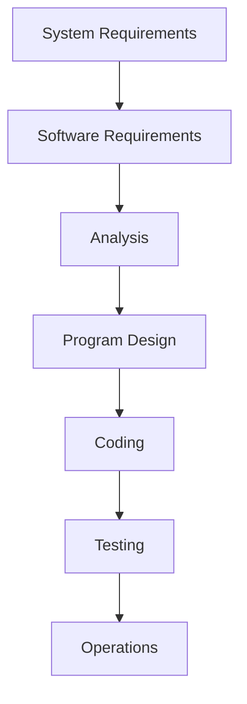

# 📚 CS342 Software Engineering: Lecture 2 - Lazy Edition 😴

This lecture is all about how software gets made, from the first idea to saying goodbye 👋.

---

## 🏗️ Software Development Life-Cycle (SDLC): The Recipe for Software

Think of the SDLC as a detailed recipe for building software. It's a series of steps to get from a messy idea to a finished product.

### Why do we even *need* this "recipe"?
*   **Stay Organized:** Keeps everyone on the team knowing what to do and when. No chaos!
*   **Big Projects:** Helps handle huge software projects that one person can't tackle.
*   **Smooth Sailing:** Makes sure different parts of the development process talk to each other nicely, catching mistakes early and making it easy to adapt the plan.

### The 7 Main Ingredients (Phases) of the SDLC
1.  **Requirements Phase:** Figure out what the customer *wants*. This is the "what are we making?" step.
2.  **Specification/Analysis Phase:** Turn those wants into a clear, detailed plan or "contract." Still figuring out *what* it needs to do, but more formally.
3.  **Design Phase:** Decide *how* we're going to build it.
    *   **High-level:** Architectural design – think building blueprints (like, "this will be the kitchen").
    *   **Detailed:** Design of each little piece (like, "the kitchen needs a sink here and a fridge there").
4.  **Implementation Phase:** **Coding!** Writing the actual software.
5.  **Testing Phase:** Check if it actually works.
    *   **Unit Testing:** Testing tiny pieces of code individually.
    *   **Integration Testing:** Making sure all the tiny pieces work together.
6.  **Maintenance Phase:** After the software is out, deal with any changes, bug fixes, or new features the client wants.
7.  **Retirement:** When the software is old, unsupported, and removed from service. "So long, partner!"

---

## 🌊 Classical Software Life-Cycle Model: The Waterfall Method

The "Waterfall" model is the OG (original) software development approach. It's **linear and sequential**, meaning you finish one step completely before moving to the next. Like a waterfall, water only flows one way!

### The Waterfall Flow

### Classical Phases in Detail (Still Waterfall!)

*   **1. Requirements:** Explore the idea, get the client's demands.
*   **2. Analysis (Specification):** Analyze demands, write a detailed *specification document*. This document clearly states "WHAT the product is supposed to do."
*   **3. Design:** Architectural design first, then detailed design. This tells you "HOW we do it."
*   **4. Implementation (Coding):** Pick a language, then code away!
    *   Includes **Unit Testing** (testing small bits) and **Integrated Testing** (testing how pieces fit).
*   **5. Testing:**
    *   **Product Testing:** General testing of the whole thing.
    *   **Acceptance Testing:** The client tests it to make sure it meets their needs.
*   **6. Post-delivery Maintenance:** (This is a big one!)
    *   **Corrective:** Fixing bugs that pop up *after* release.
    *   **Adaptive:** Making changes to fit a new environment (e.g., new operating system).
    *   **Perfective:** Adding new features or improving performance because the client wants more.
*   **7. Retirement:** The software is taken out of service.

---

## 🛠️ Maintenance: Classical vs. Modern View

### Classical View of Maintenance
*   It's all about **time**. Maintenance happens *after* the initial development. It's a "development-then-maintenance" mindset.
*   **Development Fault:** Found and fixed *before* the software is installed.
*   **Maintenance Fault:** Found and fixed *after* the software is installed.

### Modern View of Maintenance (ISO/IEC Definition)
*   Maintenance isn't just "after release." It's **ANY** time you modify software because of a problem, for improvement, or adaptation. It doesn't matter *when* you do it (before or after installation).

---

## 💸 Fault Detection & Correction: Find 'Em Early, Save Big!

### The Golden Rule: Early Detection = Less Cost
*   The earlier you find and fix a bug, the cheaper it is.
    *   Imagine fixing a typo in the initial blueprint (cheap!) vs. fixing a structural flaw after the building is half-built (EXPENSIVE!).
*   **Graph Highlight:** Fixing a bug during "Requirements/Architecture" costs almost nothing. Fixing it after "Production/Post-release" can cost **30 times more!**

### What happens if you find a fault...
*   **Early (before coding):** Mostly change documents and plans.
*   **Late (after installation):**
    *   Change the actual code AND documentation.
    *   Test the change.
    *   Perform **regression testing** (check if your fix broke anything else!).
    *   Re-install the product. (Way more hassle!)

### Where do bugs hide?
*   Surprisingly, 60-70% of faults in big projects are found in the **early phases:** Requirements, Analysis, and Design.
*   **Goal:** Develop better techniques for these early phases to catch faults ASAP, reducing the total number of bugs and overall cost.

---

## 🤝 Team Programming Aspects: When Many Hands Make (or Break) the Work

Modern software is too massive for one person. It's built by teams!

### Why Teams are Tricky
*   **Interfacing Problems:** Different parts of the software, built by different team members, might not talk to each other correctly. (Like trying to plug a USB-C into an old USB-A port without an adapter).
*   **Communication Problems:** Team members might misunderstand each other or not communicate effectively. (Classic "I thought you were doing that!" moment).

### The Solution: Good Software Engineering!
*   Software Engineering aims to manage and organize teams effectively to avoid these issues.

---

## 🔄 Software Engineering Paradigms: Structured vs. Object-Oriented

These are different ways to think about and build software.

### 📜 Structured Paradigm
*   Focuses on **process (actions)** OR **data**, but **not both at the same time**.
*   **Process-oriented:** Think step-by-step instructions (like a recipe: mix, bake, cool). Used for real-time systems, automation, communication protocols.
*   **Data-oriented:** Focuses on how data is organized and handled (like a database schema). Used for databases, transactional systems, data retrieval.
*   **Pros:** Works great for **small products**.
*   **Cons:** **Fails with large products** (> 50,000 lines of code) because:
    *   More code = more errors.
    *   Higher maintenance costs because separating process and data makes changes harder to manage.

### 📦 Object-Oriented (OO) Paradigm
*   Focuses on **BOTH process (actions) AND data together**. This is the modern way!
*   **What's an "Object"?** It's like a mini-program that combines data (what it *is*) and the actions you can perform on that data (what it *does*).
*   **Example:** A `Bank Account` object:
    *   **Data:** `account balance`
    *   **Actions:** `deposit()`, `withdraw()`, etc.
*   **Key Idea:** Data and actions are equally important and packaged together. This makes software more modular, reusable, and easier to maintain for large projects.

---