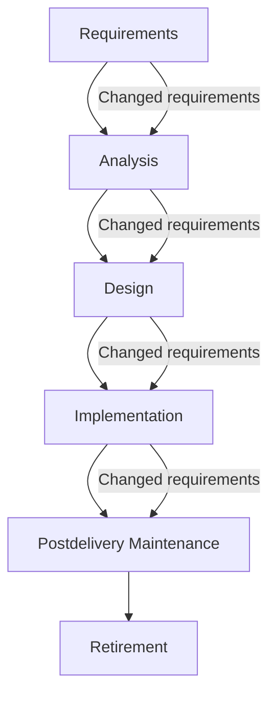
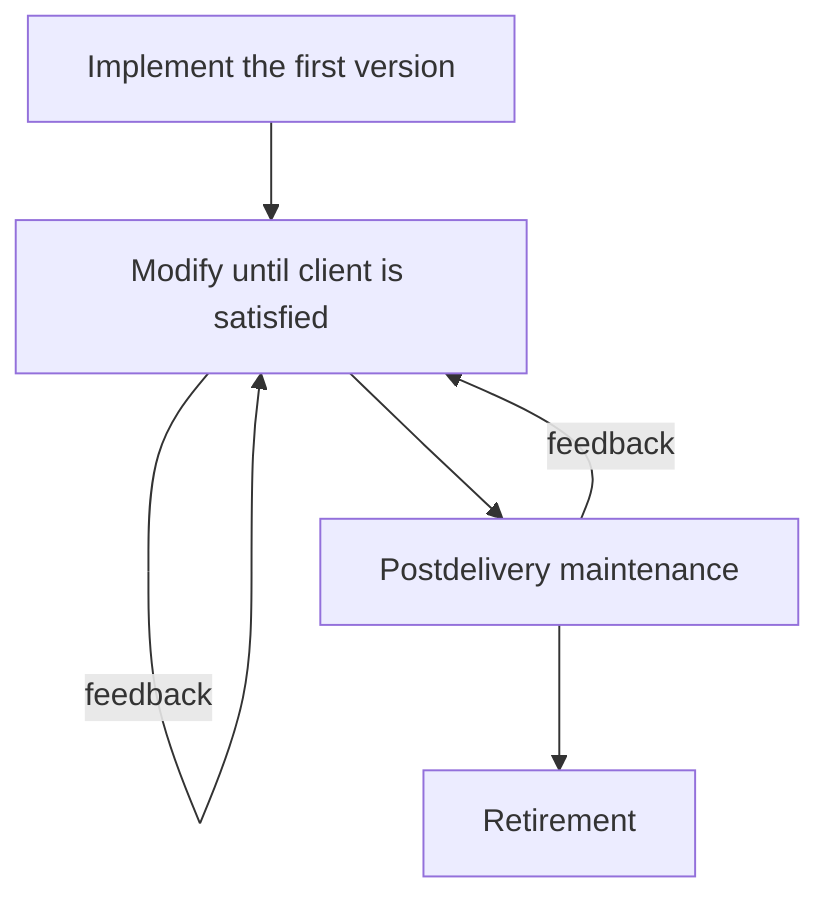
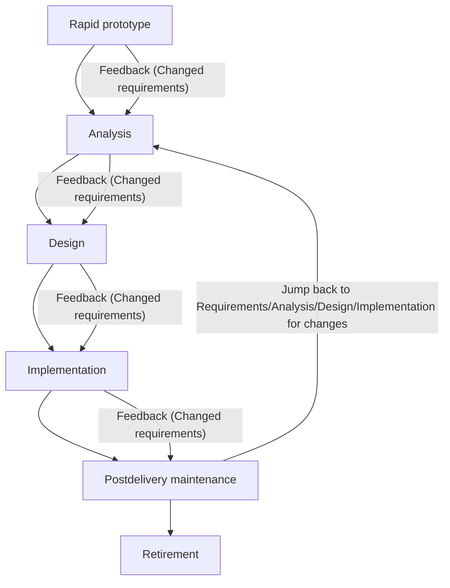
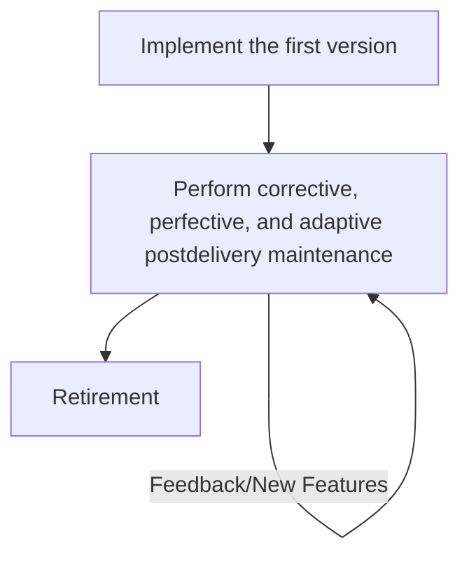
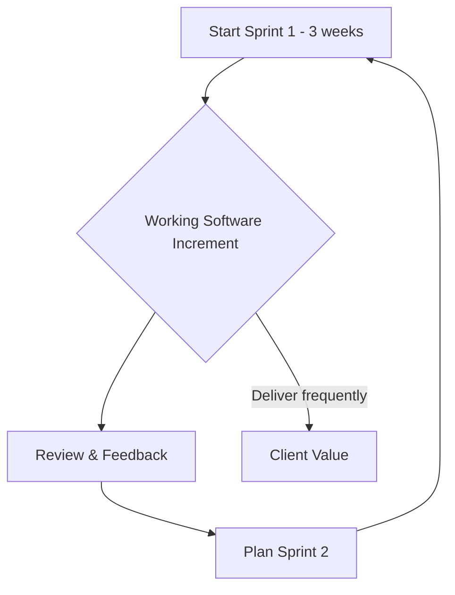
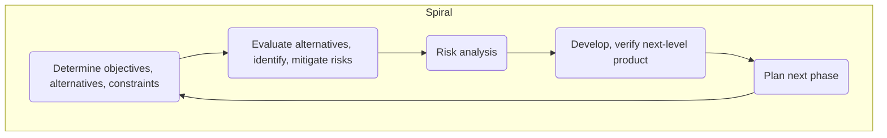

# 📚 CS342 Software Engineering: Lecture 3 - Software Life-Cycle Models (The Different Recipes) 😴

Last time, we talked about *why* we need a plan (SDLC). This lecture is all about *what kinds* of plans (models) there are. Each one is a different "recipe" for building software.

## 🌊 Waterfall Model: The Old School, Step-by-Step Recipe

You already know this one from Lecture 2! It's like building a house – you lay the foundation, then the walls, then the roof. No going back easily!

*   **How it Works (The Flow):** You finish one phase completely before moving to the next.
    *   **Feedback Loops?** Supposedly *limited* or *no* backward loops, but the diagram actually *shows* them for "Changed Requirements." In reality, requirements can *always* change, even in waterfall.
*   **Documentation-Driven:** Lots and lots of documents at each step. This is like a very detailed blueprint.
*   **The Good Stuff (Advantages):**
    *   **Clear Documentation:** You know exactly what's supposed to happen at each stage. Good for audit trails.
    *   **Easier Maintenance (ish):** Because everything is so well-documented, when you *do* need to fix something later, you have clear plans to refer to.
*   **The Not-So-Good Stuff (Disadvantages):**
    *   **Rigid:** Hard to change things once you've moved past a phase. Like trying to move a wall after the roof is on.
    *   **Client Understanding:** Clients often struggle with big, complex specification documents. They might not really know what they want until they see it.

*Note: The feedback loops in the diagram are actually *post-change* feedback, not inherent iterative loops for improvement within the original design.*

---

## 🤷‍♀️ Code-and-Fix Model: Just Start Coding!

This is the "wing it" approach. Super easy to start, but gets messy FAST.

*   **How it Works:**
    1.  **Implement first version.**
    2.  **Modify** until the client *says* they're satisfied.
    3.  Then, maintenance (which is a nightmare).
*   **No Plan, No Problem?** Nope, big problem!
    *   **No Design:** You're building without blueprints.
    *   **No Specifications:** No agreement on what it's supposed to do.
*   **Result:**
    *   **Easiest to Start:** Just open your IDE and go!
    *   **Most Expensive:** Bugs pile up, changes are chaotic, maintenance is horrible. You pay for it dearly later.

---

## 🏃‍♀️ Rapid Prototyping Model: Show, Tell, Refine!

This model is all about getting something tangible in front of the client quickly to get feedback. Think of it like building a quick clay model before sculpting the marble statue.

*   **How it Works:**
    1.  Build a **"rapid prototype"** (a quick, first version).
    2.  **Show it to the user** and let them try it.
    3.  Once the client likes the prototype, *then* you write the detailed **specification document**.
*   **Key Idea:** It's **"built for change"**. Imperfections are fine in the prototype; it only needs to show *key functionality* and what the *client sees*. Error checking can wait.
*   **Feedback Loops:** Less rigid than Waterfall. You get early feedback from the prototype, reducing big surprises later. Even in post-delivery maintenance, you can jump back to earlier phases.
*   **Human Factors (HCI - Human-Computer Interface):** The prototype is all about how users interact with the system. You need to consider:
    *   **User Interface:** No scary command lines! Think point-and-click, menus, icons.
    *   **User Experience:** Avoid long menus, keep appearance consistent, allow for different "expertise levels" in the interface (e.g., simple mode vs. advanced mode).
*   **Reusing Prototypes (Careful!):** Reusing a rapid prototype as part of the *final product* is essentially doing "code-and-fix" if not planned. It's only safe if:
    *   It was **prearranged** that parts would be reusable.
    *   Those parts pass **SQA (Software Quality Assurance) inspections**.
*   **Languages:** Often uses **4GLs (Fourth-Generation Languages)** which are good for quick development.

---

## 🌍 Open-Source Model: The Community Build

This is how projects like Linux or Firefox are developed. It's very collaborative and relies on user engagement.

*   **Two "Informal" Phases:**
    1.  **First Phase (Initial Release):**
        *   An initial version is built.
        *   It's **made available via the Internet** (that's the "open" part).
        *   If there's enough interest and downloads, then users start getting involved.
        *   Users become **"co-developers"**, and the product grows.
    2.  **Second Phase (Community Maintenance):** This is mostly about **post-delivery maintenance** by the community.
        *   **Correcting Defects:** Users report bugs, others fix them.
        *   **Adaptive Maintenance:** Adapting the program for new environments.
        *   **Perfective Maintenance:** Adding new features and functionality.
        *   The "co-developers" are really **"co-maintainers"** because a lot of the work is ongoing improvements and fixes.

---

## ⚡ Agile Model: Iterative & Flexible

Agile is a mindset more than a rigid model. It's all about quick, iterative delivery and embracing change.

*   **Core Principle:** **Deliver working software frequently.** Don't wait until the very end to show something.
*   **Time-Boxing:** The secret sauce!
    *   Set a **specific amount of time for a task** (e.g., 3 weeks per "iteration" or "sprint").
    *   The **developer team has a fixed time limit** to deliver *something*.
    *   **Crucial:** Agile demands **fixed time, not fixed features**. If you can't finish everything in the timebox, you reduce the scope of work, not extend the time.
*   **Client Confidence:** Clients get new versions with added functionality very frequently (e.g., every 3 weeks), building trust.
*   **No Client Interference (during the timebox):** Once a timebox starts, the team is left alone to deliver.
*   **Good for:**
    *   **Small-scale software development.**
    *   Projects where **requirements are dynamic or frequently change**. This is its strength!
*   **Evaluation Key:** How it impacts post-delivery maintenance.
*   **Refactoring:** A super important part of Agile.
    *   It's continuously **reorganizing the code** without changing its external behavior.
    *   It **continues during maintenance**.
    *   It **consumes a large amount of the overall cost** because it's an ongoing investment in code health.
    *   **Goal:** Ensure the design runs all test cases even after code changes.
*   **Weakness:** Less data on its impact on maintenance.

### Agile Flow (simplified idea of sprints):

*Visual thought: Imagine a cycle of short sprints delivering increments, not one long linear flow.*

---

## 🤝 Synchronize and Stabilize Model: Microsoft's Approach

This is how Microsoft used to do things (and influences some of their current processes). It's all about parallel work that comes together regularly.

*   **Key Steps:**
    1.  **Requirements Analysis:** Talk to **potential customers** (interviews).
    2.  **Specifications:** Document the requirements.
    3.  **Divide Project:** Break it into 3 or 4 main **components**.
    4.  **Parallel Work:** **Small teams** work on each component **in parallel**.
    5.  **Daily Synchronization:** At the end of each day, all teams **synchronize** (test and debug their integrated code).
    6.  **Build Stabilization:** At the end of a "build" (a larger period), you **stabilize** (fix all detected faults and "freeze" the build – no more changes to *those* specifications).
*   **Benefits of Repeated Synchronization:**
    *   Ensures all components **always work together**.
    *   Gives **early insights** into how the whole product operates.

---

## 🌀 Spiral Model: Risk-Driven & Iterative

This model is like a mashup of Rapid Prototyping and Waterfall, but with a huge emphasis on **risk analysis** at every step. Think of a spiral that keeps expanding.

*   **Simplified Idea:** It's **Rapid Prototyping + Risk Analysis *before* each phase**.
*   **The Big Rule:** If **all risks cannot be solved**, the project is **terminated immediately**. No throwing good money after bad!
*   **Phases Preceded by:**
    *   **Risk Analysis:** What could go wrong?
    *   **Alternatives:** What other options do we have?
*   **Phases Followed by:**
    *   **Evaluation:** How did that phase go?
    *   **Planning of the Next Phase:** What's next based on what we learned and the risks?
*   **Spiral Dimensions:**
    *   **Radial (outward):** Represents the **accumulated cost** up to date. (As you spiral out, cost increases).
    *   **Angular (around):** Represents **progress through the spiral** (moving through the phases).
*   **Each Spiral Cycle = A Phase:** Each loop around the spiral is a complete pass through the steps for a given phase (objectives, risk analysis, development, planning).

*Visual: Imagine the above diagram wrapping around in a spiral. A new "A" connects to "E" of the previous loop, getting further out each time.*

*   **Strengths:**
    *   **Easy to Evaluate Testing:** Because of constant risk analysis, you know how much testing is needed.
    *   **No Development/Maintenance Distinction:** Maintenance is just another "cycle of the spiral" – it's integrated.
*   **Weaknesses:**
    *   Only for **large-scale software**.
    *   Usually for **internal (in-house) software** projects.
    *   Requires developers **competent in risk analysis** (which isn't always easy!).

---

## 🧩 The Unified Process (UP): The OO Blueprint Language

This isn't a strict "series of steps" like Waterfall. It's a highly **adaptable methodology** for building software, especially using Object-Oriented principles.

*   **Created by:** Booch, Jacobson, and Rumbaugh (the "three amigos" of OO!)
*   **Not a Fixed Series of Steps:** Because software types vary so much, one rigid methodology wouldn't work.
*   **Adaptable:** You modify it to fit your specific project.
*   **Key Feature: A Modeling Technique:**
    *   It uses **UML diagrams** (Unified Modeling Language) to **represent (model)** different parts of the software.
    *   **UML is a graphical tool:** It lets software engineers communicate complex ideas **quickly and accurately** through diagrams, not just text.
    *   Think of it as a common language (like musical notation) for describing how software is built.

---

## 📊 Comparison of Life-Cycle Models (The TL;DR Table)

| Life-Cycle Model             | Strengths                                                                     | Weaknesses                                                                 |
| :--------------------------- | :---------------------------------------------------------------------------- | :------------------------------------------------------------------------- |
| **Code-and-Fix**             | Fine for short programs with no maintenance (almost none in real life!)       | **Totally unsatisfactory** for real programs; most expensive model         |
| **Waterfall**                | Disciplined, documentation-driven, ensures needs are met (if requirements don't change) | Client may not get what they want; hard for clients to understand docs    |
| **Rapid Prototyping**        | Builds understanding for the client, good when requirements are vague, built for change | Not proven beyond all doubt, can lead to "code-and-fix" if prototype reused unwisely |
| **Open-Source**              | Has worked extremely well (Linux, Firefox); meets future user needs            | Limited applicability; usually doesn't work for small/traditional projects |
| **Agile Processes**          | Delivers working software frequently, good when requirements are dynamic/changed | Appears to work only on small-scale projects; high refactoring cost       |
| **Synchronize-and-Stabilize**| Ensures integrated components; early operational insights                    | Not widely used outside Microsoft                                          |
| **Spiral Model**             | Risk-driven, integrates development and maintenance seamlessly                | Only for large-scale, in-house products; requires strong risk analysis skills |
| **Unified Process**          | Closely models real-world production, underlying many iterative/incremental models | (Implied: Complexity, requires OO expertise, not a silver bullet)          |
