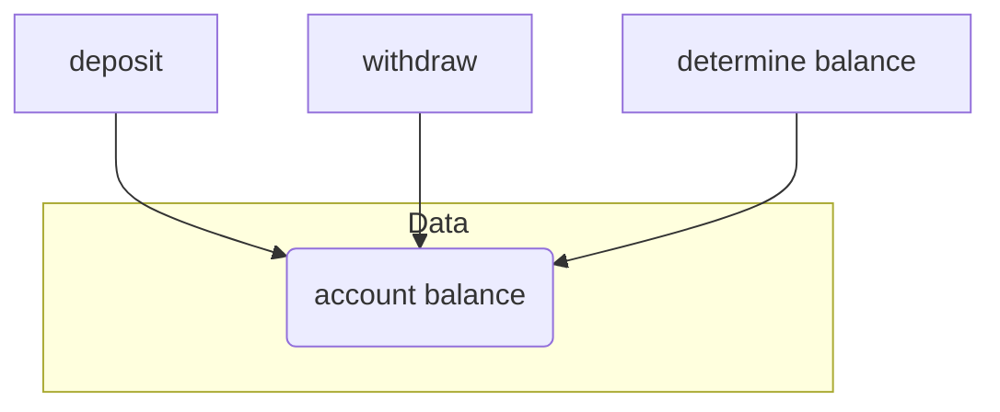
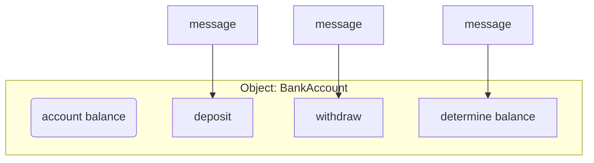

# 📚 CS342 Software Engineering: Lecture 4 - Project Planning & Paradigms 😴

Alright, buckle up! This lecture is about getting software projects off the ground and how different ways of thinking about code (Structured vs. Object-Oriented) affect everything.

---

## 🗺️ Project Plan: The Initial Roadmap

Before you write a single line of code, you need a plan! The "inception" (first) phase of a software project needs a solid project plan covering these four main things:

1.  **Introduction:** Who, what, why, where.
2.  **Activities Organization:** Who does what, and how they connect.
3.  **Activities Scheduling:** When things happen, and with what resources.
4.  **Risk Management:** What could go wrong, and how to deal with it.

---

### 1. 📝 Introduction: Setting the Stage

This part is like the executive summary of your project. It includes:

*   **Project overview:** A quick summary of the whole thing.
*   **Project deliverables:** What exactly are we making? (e.g., software, documentation, training).
*   **Hardware and software resource requirements:** What machines, tools, and other software do we need?
*   **Reference materials:** Any existing documents, research, or previous versions.
*   **Definitions and acronyms:** Explain any jargon so everyone's on the same page.

---

### 2. 👥 Activities Organization: Who's Doing What?

This is about setting up the team and how they'll work.

*   **Organizational Structure:** How the team is managed, who reports to whom, and how different parts of the project connect.
*   **Project roles/responsibilities:** Clear job descriptions for everyone.
*   **Major functions and processes:** How the work actually gets done.
*   **Assumptions, dependencies, and constraints:** What we assume to be true, what relies on something else, and any limitations (like budget or time).
*   **Monitoring and controlling mechanisms:** How we check progress, report issues, and review work.

---

### 3. ⏰ Activities Scheduling: The Timeline & Budget

This is where you plan the "when" and "with what."

*   **Divide project into sub-systems and tasks:** Break down the big goal into smaller, manageable chunks.
*   **Dependencies:** What tasks *must* happen before others?
*   **Resource estimation:** How many people, computers, specialized hardware, or extra software will each task need?
*   **Budget and resource allocation:** How much money and how many resources are assigned to each task.
*   **Schedule:** Deadlines, how costs are tracked, and key performance indicators to see if you're on track.

---

### 4. ⚠️ Risk Management: Expect the Unexpected!

You can't predict everything, but you can plan for risks!

*   **Risk identification:** What bad things *could* happen?
*   **Risk analysis:** How likely is it, and how bad would it be?
*   **Risk controlling:** What can we do to stop it or lessen its impact?
*   **Risk monitoring:** Keep an eye on identified risks to see if they're about to happen.

---

## ➕ Additional Project Plan Activities: Beyond the Basics

These are other important things that happen during a project's life.

### In the First Phase (Inception):
*   **Kick-off meeting:** Get everyone together, set goals, build excitement.
*   **Team building:** Help people work well together.
*   **Discussions with end-user:** Keep talking to the people who will use the software to make sure you're building what they want.
*   **Acceptance testing plan:** Figure out *how* the client will approve the software.

### In the Rest of Project Phases:
*   **Risk monitoring continuity:** Keep an eye on risks throughout the project.
*   **Schedule monitoring continuity:** Always check if you're hitting your deadlines.
*   **Weekly checkpoint meetings:** Quick sync-ups to see progress and tackle immediate issues.
*   **Formal review meetings:** More structured meetings to review bigger chunks of work.
*   **Meetings with end-user:** Continuous engagement with users is crucial.

---

## 🏛️ Structured vs. 📦 Object-Oriented Development: Different Ways to Build

Last lecture touched on this. Now let's dig deeper into how these different approaches structure your software.

### Structured Paradigm: The "Big Block" Approach
*   Conceptually, the software is seen as a **single unit**, even if it has many parts.
*   **How data and actions are handled:** Imagine a central data pool, and functions (like `deposit`, `withdraw`) act on that data from outside.

*   **Visibility:** In this paradigm, if you have `account_balance` information, *all modules* might know the details of how it's implemented. No secrets!

### Object-Oriented (OO) Paradigm: The "Self-Contained Box" Approach
*   Software is built from many **independent "units" called classes (or objects)**.
*   **Lower complexity:** Each object is a self-contained unit, making the overall system easier to manage.
*   **Better maintenance and development:** Changes to one object are less likely to break others.
*   **Action responsibility:** Actions are part of the object itself. You tell the object what to do.

*   **Information Hiding (Encapsulation):** The solid line around `accountBalance` means that outside the object, you *don't know* or *don't need to know* how `accountBalance` is stored or managed. You just send messages (`deposit`, `withdraw`) to the object, and it handles its internal data. This reduces "regression faults" (fixing one thing and breaking another).
*   **Communication:** Objects communicate by **sending messages** (calling methods/functions).
*   **Promotes Reuse:** Because objects are independent and self-contained, they're much easier to reuse in other parts of the software or other projects.

---

### Structured vs. Object-Oriented Workflows: The Planning Difference

Both paradigms still involve analysis and design, but they focus on different things.

*   **Structural Prototype Workflow:**
    *   **Analysis:** Determine **WHAT** to do (the requirements).
    *   **Design:** Determine **HOW** to do it. This involves:
        *   Architectural design (big picture).
        *   Determining modules.
        *   Detailed design for *each module*.

*   **Object-Oriented Prototype Workflow:**
    *   **Analysis:** Determine **WHAT** to do, but also crucially, **DETERMINE THE OBJECTS**.
    *   **Design:** Determine **HOW** to do it, and critically, **DESIGN THE OBJECTS** (their data and methods).

---

## 🚫 Mixing Paradigms? (Structured + OO)

*   Generally, trying to use an Object-Oriented prototype to "enhance" a product originally built with a Structured approach is like **"water and oil" – they don't mix well.**
*   **Exception:** You *can* mix them if the new OO part is **totally disjoint** and doesn't mess with the internal workings of the old structured system.
    *   **Example:** Adding a fancy new **Graphical User Interface (GUI)** (which is often object-oriented) on top of an old command-line structured system. The GUI just sends high-level commands, not fiddling with internals.

---

## 🗣️ Software Engineering Terminology Cheat Sheet

Quick definitions to help you out:

*   **Program / Product:** A significant, non-trivial piece of software.
*   **System:** The complete package – software + hardware working together.
*   **Methodology / Prototype:** A collection of techniques or a working model used to develop software.
*   **Bug:** A "fault" in the software that causes it to behave incorrectly.

### Object-Oriented Specific Terms:

*   **Data component (of an object):** The information an object holds.
    *   Also known as a "state variable," "field" (in C++), or generically, an **"attribute."**
*   **Action component (of an object):** What an object can *do*.
    *   Also known as a "member function" (in C++), or generically, a **"method."**

---

## ⚖️ Software Development in Theory vs. Practice: The Reality Check

What we learn in books versus how it really goes down!

*   **In Theory:**
    *   Development is often described as **linear** (one phase after the other, like Waterfall).
    *   You **start from scratch** with each new project.
*   **In Practice (The Real World):**
    *   Software development is **rarely linear**; it's often messy and involves going back and forth.
    *   The client's **requirements *will* change** while the software is being developed. Get used to it!

### Example: The GJU Registration System (A Realistic Nightmare)
This example highlights how things go wrong and change in the real world:

*   **Phase 1:** First version implemented (Yay! 🎉)
*   **Phase 2:** A fault is found! The system is too slow because of a bad implementation.
    *   Changes start. (Reality check: it's not perfect the first time!)
*   **Phase 3:** A *new design* is adopted (e.g., they use a faster algorithm).
    *   (Reality check: You might need to backtrack and redesign.)
*   **Phase 4:** The *requirements change*! Accuracy needs to be increased.
    *   (Reality check: Clients change their minds or discover new needs.)
*   **Phase 5:** A few years later, these problems *still carry on*.
    *   (Reality check: Old problems can linger and become "technical debt," affecting the system for a long time.)

This GJU example shows that real software development is an iterative, problem-solving journey, not a smooth, linear ride from start to finish. Flexibility and adaptation are key!