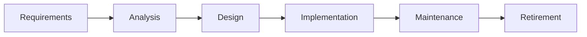
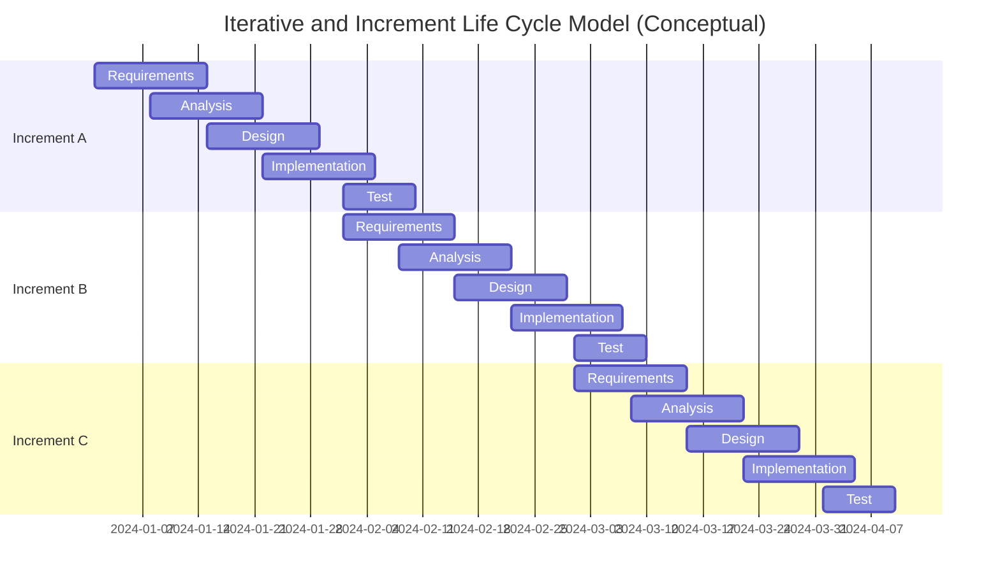

# 📚 CS342 Software Engineering: Lecture 5 - More Life-Cycle Models (Fancy Recipes!) 😴

Alright, last time we covered the basic "recipes" for building software. Now, let's look at more complex ones, especially how models can be "one-dimensional" (linear) or "two-dimensional" (overlapping, iterative).

---

## 📏 One-Dimensional Model: The Straight Line

*   Think of the classic **Waterfall model** here. It's "one-dimensional" because it moves along a single axis (time or phases).
*   Each phase supposedly finishes completely before the next begins, like steps in a sequence.

*It's a straight shot, or tries to be.*

---

## 🌳 Evolution-Tree Model: Multiple "Mini-Waterfalls"

This one is like building a series of separate, small software projects (called "episodes" or "increments"), each often resembling a tiny Waterfall.

*   **Episodes (Periods):** The development happens in distinct chunks.
*   **Baselines:** At the end of each episode, you get a "baseline" – a complete, stable set of software components and documents (like a snapshot).
*   **Example:** At the end of Episode 3, you might have `Requirements1`, `Analysis1`, `Design3`, `Implementation3`. This means the requirements and initial analysis were from the first episode, but design and implementation were refined/completed in the third.

---

## 📐 Two-Dimensional Life-Cycle Model: The Matrix!

This is where things get more real-world. A **dynamic life cycle** isn't just sequential; it involves two axes:

*   **Phases (X-axis / Business Contexts):** These are the major milestones or stages (like Inception, Elaboration, Construction, Transition in Unified Process).
*   **Workflows (Y-axis / Technical Contexts):** These are the activities that happen *throughout* the project (like Requirements, Analysis, Design, Implementation, Testing).

**Example:** The **Unified Process (UP)** is a prime example of a two-dimensional model.

### Why Two-Dimensional? The Reality Check!

*   **Real World ≠ Ideal World:** In an "ideal" world, you'd finish all analysis, then all design, etc. But that's not how big projects work.
*   **Too Big for One Phase:** Development tasks are often too massive to fit neatly into single, separate phases.
*   **Miller's Law Applied:** We can only focus on about "seven chunks" of information at a time. To handle huge projects, you use **stepwise refinement** (breaking it down).
    *   Focus on the *most important* things first, postpone less important ones.
    *   This leads to **incremental development**.
*   **Not Enough Info Upfront:** At the start of a project, you rarely have *all* the information to plan everything perfectly. So, you build in chunks.
*   **Divide and Conquer:** A software product is divided into **subsystems**, and if those are still too big, into **components**.
*   **Unified Process as the Solution:** It's good for managing big problems by breaking them into smaller, independent "sub-problems." It gives you a **framework for increments and iterations**.

---

## ➡️ Sequential Phases vs. Overlapping Workflows: What Really Happens

*   **"Sequential phases" don't really exist** perfectly in the real world.
*   Instead, the core activities – **Requirements, Analysis, Design, Implementation, and Testing (workflows)** – actually **overlap** and happen throughout the project.
*   **Dominance:** At any given time, one workflow might "dominate."
    *   **Beginning of Life Cycle:** **Requirements workflow** is dominant.
    *   **End of Life Cycle:** **Implementation and Test workflows** are dominant.
    *   **Planning and Documentation:** These happen *all the time*.

---

## 🔄 Iterative and Incremental Life-Cycle Model: Build a Little, Test a Little

This is a very common and practical way to develop software.

*   **Iterative:** You repeat phases. You build a version, learn from it, then go back and build a *better* version. "Each successive software version is intended to be closer to its target than its predecessor."
*   **Incremental:** You deliver working parts of the software in small "increments" rather than waiting for the whole thing to be finished.
*   **Conjunction:** Iterations and increments are used *together*. You don't just do one phase then the next; you're doing *multiple workflows* in each incremental step.

### Visualizing Iterative & Incremental (from slide 13):

*Note how activities overlap within each increment.*

---

## 🏛️ The Phases of the Unified Process (UP): Incremental & Workflow-Driven

The UP is a practical, object-oriented way to do iterative and incremental development. Its "increments" are called "phases."

The UP breaks the software lifecycle into four major phases (these are like the X-axis "business contexts"):

1.  **Inception Phase (The "Starting" Phase):**
    *   **Aim:** Figure out if the product is even **feasible** (can we build it?).
    *   **Activities:**
        *   Understand the "domain" (the problem area).
        *   Build a **business model** (how it makes money/value).
        *   Define the project's **scope** (what's in, what's out).
        *   Create the **initial business case** (why do this project?).
    *   **Business Case Questions:**
        *   Is it **cost-effective**?
        *   **ROI (Return on Investment)?** How long until it pays off?
        *   What's the **cost of *not* building** it?
        *   If sold, **marketing studies** done?
        *   Can it be **delivered in time**? What's the **impact of being late**?
    *   **Risk Focus:** Identify initial risks and think how to reduce them. **Rank risks** and tackle **critical ones first.**
        *   **Technical Risks:** Can we actually build this tech?
        *   **Requirements Risks:** Are we building the *right* thing? (Getting requirements wrong).
        *   **Architecture Risks:** Is our foundational design strong enough? (Not robust enough).
        *   *Example reduction:* Need new hardware? Order backup from another supplier.
    *   **Workflow Activities in Inception:**
        *   **Analysis:** Small amount, extract info for architecture design.
        *   **Design:** Small amount, extract info for functional implementation.
        *   **Implementation (Coding):** Generally *not* done, *except* for a "proof-of-concept" prototype to test if a key part is feasible.
        *   **Test:** Starts early to ensure requirements are accurate.
    *   **Planning:** At the start, you only plan for the Inception phase itself because you don't have enough info for the whole project. At the end of Inception, you plan for the *next* phase (Elaboration).
    *   **Deliverables (Documents):** Initial versions of domain model, business model, requirements, analysis, architecture, risk list, use cases, and the plan for the Elaboration phase.

2.  **Elaboration Phase (The "Preparation" Phase):**
    *   **Aim:** **Refine the initial requirements.** Make them solid!
    *   **Activities:**
        *   Refine the **architecture** (make it more detailed).
        *   Monitor and refine **risks**.
        *   Refine the **business case**.
        *   Produce the overall **project management plan**.
    *   **Tasks:**
        *   **Complete the requirements workflow.**
        *   Perform virtually the **entire analysis workflow.**
        *   **Start the design of the architecture.**
    *   **Deliverables (Documents):** Completed domain model, business case, requirements, analysis, updated architecture, updated risks list, and the updated project management plan (for the *rest* of the project!).

3.  **Construction Phase (The "Design & Implementation" Phase):**
    *   **Aim:** Produce the **first operational-quality version** of the software product. This is often called the **"beta release."**
    *   **Tasks:** Focus heavily on:
        *   **Implementation (Coding)!**
        *   **Testing:**
            *   **Unit testing** (individual modules).
            *   **Integration testing** (subsystems working together).
            *   **Product testing** (the overall system).
    *   **Deliverables (Documents):** Initial user manuals, all beta release artifacts, completed architecture, updated risks list, updated project management plan, and if needed, an updated business case.

4.  **Transition Phase (The "Installation & Testing" Phase):**
    *   **Aim:** Ensure that the **client's requirements have been met** and the software is ready for release.
    *   **Driven by:** **Feedback from the sites** where the beta release was installed.
    *   **Tasks:**
        *   Correct remaining faults.
        *   Complete all manuals.
        *   Discover any *new* unidentified risks.
    *   **Deliverables (Documents):** All final versions of artifacts, and all completed manuals.

---

That's the run-down of these more advanced models and the phases of the Unified Process. Think of it as peeling an onion: you start broad and get more detailed and specific with each layer (or increment).