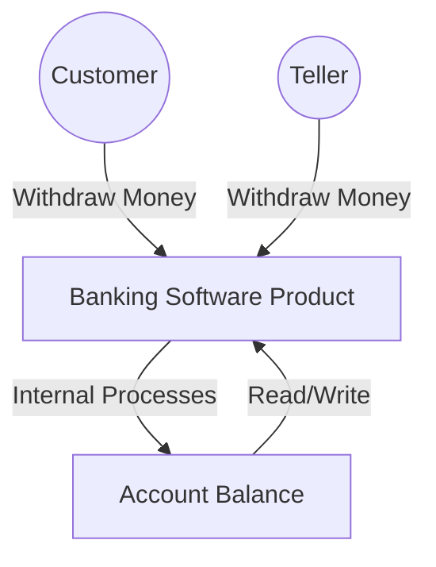
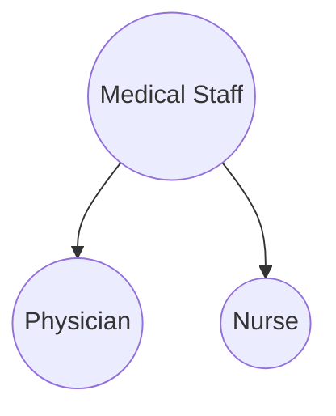
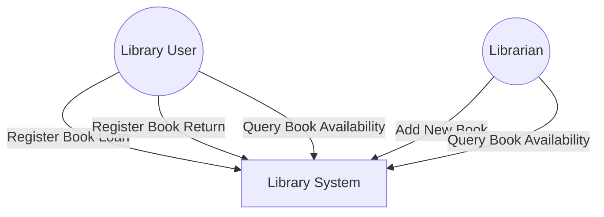
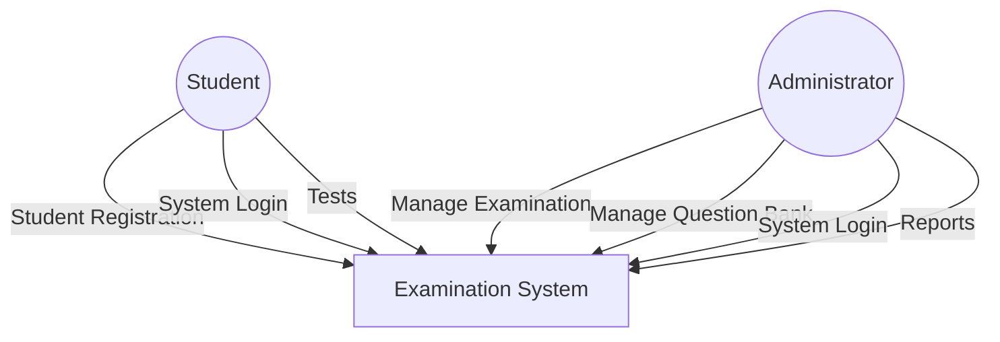

# 📚 CS342 Software Engineering: Lecture 6 - Requirements & Use Cases (What the Heck Are We Building?!) 😴

This lecture is all about figuring out *what* software to build. It's the first crucial step, because if you build the wrong thing, it doesn't matter how well you build it!

## 🎯 The Requirements Workflow: The "What" Phase

The main goal here is to nail down **what the client actually needs** (and any limits or **constraints** they have). It answers the core question:

**"What must the product be able to do?"**

### Client Constraints (Things they need or can't budge on):

*   **Deadline:** When does it absolutely *have* to be done?
*   **Parallel Running:** Does it need to work alongside old systems?
*   **Portability:** Does it need to run on different systems (Windows, Mac, Linux, web, mobile)?
*   **Reliability:** How often can it crash? (Ideally never!)
*   **Rapid Response Time:** How fast does it need to be? (e.g., a stock trading app needs to be lightning fast).
*   **Cost:** How much money can they spend? (Often involves a "bidding procedure" if there are multiple teams).

---

## 🏛️ The Classical Requirements Phase: Old School Approach

The old-fashioned way of gathering requirements usually involved:

1.  **Introduction:** Just generally getting started.
2.  **Analysis:** Trying to understand everything.
3.  **Building a Rapid Prototype:** Making a quick, rough version.
4.  **Client Experiments:** Letting the client and users play with the prototype to get feedback.

---

## 🛠️ CASE Tools: Software for Software Development

**CASE (Computer-Aided Software Engineering) Tools** are like IDEs for the whole software process, not just coding. They help manage the complexity.

*   **Graphical CASE Environments (for UML support):** These are tools that help you *draw* diagrams like UML (Unified Modeling Language).
    *   **Examples:** System Architect, Software through Pictures.
*   **Object-Oriented CASE Environments:** These are specific to working with Object-Oriented designs.
    *   **Examples:** IBM Rational Rose, Together, ArgoUML (open source).

---

## 🗣️ Determining the Client Needs: The Big Misconception

Here's the biggest problem: **"The client is the only source of this information."**

*   **The Misconception:** People often think they understand each other, but they don't.
    > "I know you believe you understood what you think I said, but I am not sure you realize that what you heard is not what I meant!"
    > – *Your professor, probably.*

### Solution to the Misconception: How to Really Get Needs

1.  **Get Initial Info:** Collect what they *think* they want.
2.  **Input to Unified Process:** Use this raw info as the starting point for your project plan.
3.  **Follow Unified Process:** Go through the UP steps to really figure out the client's *real* needs.
4.  **Expert Systems Analyst:** You need a pro to pull out the right information from the client.

### Steps to Extract Client Needs

1.  **Understand the Software Product Domain:**
    *   Everyone on the team must become **familiar with the "application domain"** (the specific business environment where the software will live, e.g., banking, healthcare, car rentals).
    *   **Correct terminology is essential!** Don't get lost in jargon.
    *   **Construct a Glossary:** A list of all technical words used in *this specific domain* and their exact meanings. This avoids misunderstandings.

2.  **Building a Business Model:**
    *   This is a description of the **client's business processes** as a whole.
    *   It gives you a complete picture of *how their business works*.
    *   You use various requirements' techniques to build this.

3.  **Using the Business Model to Determine Initial Requirements Techniques:** (More on these below)

4.  **Building the Business Model Use Cases:** (This is a huge part, explained later!)

5.  **Iterating the Above Steps:** It's not a one-and-done! You keep circling back to refine your understanding.

### Techniques for Getting Requirements (2.a. Requirements Techniques on slides):

1.  **Interviewing (Primary Technique):**
    *   The requirements team talks directly with the client and users to get all the important info.
    *   **Always write a report after the interview** and *give a copy to the person you interviewed*. This is for clarity and to prevent "I thought you said..." moments.

2.  **Questionnaires:**
    *   Useful when you need opinions from **hundreds of people** (e.g., surveying all employees). Not great for deep dives.

3.  **Examination of Business Forms:**
    *   Look at the forms, reports, and paperwork the client *currently uses*. This shows you **how they do business right now** and what data they collect.

4.  **Observations:**
    *   Directly **watch employees as they do their jobs.** You might uncover unspoken rules or needs that don't come up in interviews.

---

## 📝 Initial Requirements: What & How

Requirements generally fall into two categories:

*   **Functional Requirement:**
    *   Specifies an **action** the software *must be able to perform*.
    *   Often described in terms of **inputs and outputs**.
    *   Handled early in the **requirements and analysis workflows**.
    *   **Example:** "The system must allow users to log in with a username and password."

*   **Nonfunctional Requirement:**
    *   Specifies **properties** of the software itself (how well it performs, how reliable it is, limitations).
    *   **Examples:**
        *   **Platform constraints:** "Must run on Linux servers."
        *   **Response times:** "Login must complete in under 2 seconds."
        *   **Reliability:** "The system must have 99.9% uptime."
    *   **Important Note:** Some nonfunctional requirements might be deferred until the **design workflow** because you need to know *how* you're building it to promise performance.

### Dynamic Requirements: They Always Change!

*   Requirements often **change frequently**.
*   **Solution:** Keep an updated list of requirements, especially using **Use Cases** (which we'll cover next), approved by the client. This helps manage the inevitable changes.

---

## 🚗 Requirements Extraction Example: Car Rental System

Let's say you're building a Car Rental Company's system. Here are some functional requirements:

1.  Add, modify, and delete cars.
2.  Add, modify, and delete members' (clients') information.
3.  Query cars by ID or type.
4.  Query clients' information by ID or name.
5.  Provide a report of company-owned cars.
6.  Provide a report of overdue member rentals.
7.  Provide an invoice for a car rental.

These are all *actions* the system must *perform*.

---

## 🎭 Use Cases: Modeling User Interactions

A **Use Case** describes the **interaction between the software product itself and its users (actors).** It's a way to capture what a system does from an external point of view.

### Example Use Case Diagram: Banking

*Here, "Customer" and "Teller" are **actors**, and "Withdraw Money" is a **use case**.*

### Use Case Principles (Important Rules!)

*   **An actor can play more than one role.**
    *   **Example:** A bank customer can be a **Borrower** (taking a loan) *and* a **Lender** (if the bank has peer-to-peer lending).
*   **One actor can participate in multiple use cases.**
    *   **Example:** A **Borrower** might interact with "Borrow Money," "Pay Interest on Loan," and "Repay Loan Principal" use cases.
*   **An actor can represent many instances of real-world users.**
    *   The single "Borrower" actor in your diagram stands for *thousands* of bank customers.
*   **An actor need not be a human being!** This is key.
    *   **Example:** An e-commerce system that interacts with a **credit card company information system**. From the e-commerce system's view, the *credit card company's system* is an **actor**!

### Use Cases Problems: Overlapping Actors

A common issue is when actors seem to overlap, leading to confusion.

*   **Example:** In a hospital system, you might have:
    *   A use case with a "Nurse" actor.
    *   A different use case with a "Medical Staff" actor.
    *   This is problematic if "Nurse" is also "Medical Staff."

*   **Better Solution (Specialization):**
    *   Use general actors with **specializations**.
    *   **Actor: `Medical Staff`** (the general category)
    *   **Specializations:** `Physician` and `Nurse` (specific types of Medical Staff).

### Use Case Example 1: Simple Library System

Let's draw a use case diagram for a library:

*   **Processes:** Register book loan, Register book return, Query book availability, Add new book.
*   **Actors:** Library User, Librarian.

### Use Case Example 2: Simple Examination System

*   **Processes:** Student registration, Manage examination, Manage Question bank, System login, Tests, Reports.
*   **Actors:** Student, Administrator.

---

That covers the fundamentals of getting requirements and how to use use cases to model them. Good luck!