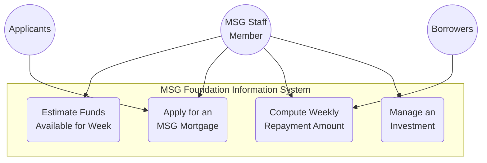
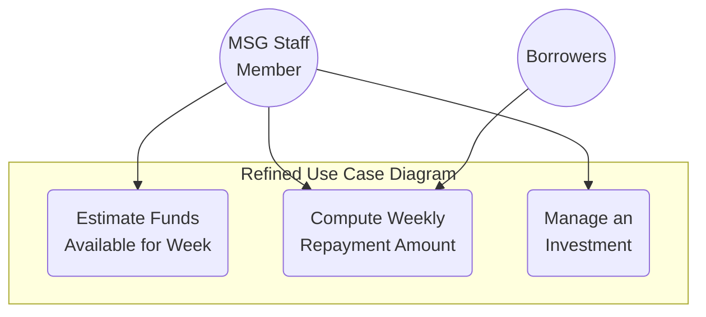

# 📚 CS342 Software Engineering: Lecture 7 - Requirements Case Study (Mortgage Money Magic) 😴

This whole lecture is a deep dive into *figuring out* what a piece of software needs to do, using a real-ish example: The MSG Foundation. This shows how you go from a vague idea to concrete requirements.

---

## 🏡 The MSG Foundation: Mortgage Help for Low-Income Couples

*   **Who they are:** MSG Foundation gives low-cost mortgage loans to help low-income couples buy houses.
*   **The Pilot Project:** MSG trustees want a small software product (a "pilot project") to figure out: **"How much money is available *each week* to purchase houses?"** This is the core goal.

---

## 🧐 Understanding the Domain (Mortgage 101 for Software Engineers)

Before building anything, you gotta understand the financial world of mortgages. This is the **"Understand the Domain"** step.

*   **P&I (Principal & Interest):** A mortgage payment is split into two parts:
    *   **Interest:** A fee you pay for borrowing the money. It's calculated on the *remaining loan balance*.
    *   **Principal:** The part of your payment that actually reduces the loan balance.
    *   *As you pay off the loan, the interest portion gets smaller, and the principal portion gets bigger.*
*   **Insurance & Taxes:** You have to pay for house insurance and real-estate taxes.
    *   To make it simple, you pay **monthly installments** for these.
    *   These go into an **escrow account** (a special savings account managed by the finance company).
    *   The finance company then pays your annual insurance and tax bills from this account for you.
*   **Other Costs:**
    *   **"Points":** An upfront fee the lender charges you, usually a percentage of the loan.
    *   **Closing Costs:** A bunch of other fees (legal, taxes, etc.) you pay when you finalize the house purchase.

### 📖 Initial Glossary (The Language of Mortgages)

Here are the key terms you need to know for this project.

| Term                | Lazy Explanation                                                          |
| :------------------ | :------------------------------------------------------------------------ |
| **Principal**       | The actual amount of money you borrowed.                                  |
| **Interest**        | The fee you pay for borrowing the money.                                  |
| **P & I**           | Your monthly payment covering both Principal and Interest.                |
| **Escrow Account**  | A savings account for your tax and insurance money, managed by the lender.|
| **Mortgage**        | A loan where your house is the collateral (if you don't pay, they take it).|
| **Closing Costs**   | All the extra fees you pay at the end to finalize the deal.               |
| **Points**          | An upfront percentage-based fee to get the loan.                          |

---

## 📈 Initial Business Model & Use Cases (The First Draft)

This is how MSG *thinks* their business works and what the software should do.

*   **Weekly Funds Estimate:** Every week, MSG staff needs to know how much money is available to lend.
*   **Applications:** Couples apply, and MSG staff checks if they qualify and if there's enough money.
*   **Repayments & Investments:** MSG gets money from existing loan repayments and from their investments.

### The Initial 4 Use Cases:

1.  **Estimate Funds Available for Week**
2.  **Apply for an MSG Mortgage**
3.  **Compute Weekly Repayment Amount**
4.  **Manage an Investment**

*Initial combined use case diagram.*

### 🤔 Actors: Who's Really Who? (A Key Insight!)

This is a tricky but important point in requirements gathering.

*   **Problem:** Do "Applicants" and "Borrowers" actually *use* the software? No, the MSG Staff Member does.
*   **So why are they actors?** Because they **initiate the use case** and **provide the data**.
*   **The Rule:** The **"real actor"** is the one who starts the process or benefits from it. The person typing the data in might just be an **"agent"** for the real actor.
    *   The **Applicant** is the real actor for "Apply for a Mortgage".
    *   The **Borrower** is the real actor for "Compute Weekly Repayment Amount".
    *   The **MSG Staff Member** is acting as an agent on their behalf.

---

## ✍️ Initial Requirements Refinement (The Most Important Step!)

Okay, this is the core lesson of the case study. The initial plan is always messy. You need to **refine it** based on the client's *actual* needs.

*   **Problem:** The 4 use cases might not all be part of the "pilot project." What did the client *really* ask for?
*   **The Client's Core Need:** "A software product to determine **how much money is available each week to purchase houses**."
*   **Let's reconsider each use case:**
    1.  **Estimate Funds Available for Week:** Yep, this is the main point. **KEEP.**
    2.  **Apply for an MSG Mortgage:** This is about processing *new* applications. It doesn't directly calculate the *money available*. So, for this specific pilot project, it's out of scope. **DISCARD.**
    3.  **Compute Weekly Repayment Amount:** Where does money come from? From existing mortgage repayments! So we need this calculation. **KEEP.**
    4.  **Manage an Investment:** Where *else* does money come from? From investments! We need to know the income from them. **KEEP.**

### The Refined Use Case Diagram

After refining, the project scope is much clearer. We're only building what's necessary for the pilot.

---

## 🧮 The Core Calculation: How Much Money is Available?

After more digging (iteration!), the systems analysts figure out the exact formula:

`Weekly Available Funds = (Weekly Investment Income) - (Weekly Operating Expenses) + (Weekly Mortgage Repayments) - (Weekly Grants Paid)`

*   **Grants:** A special MSG rule. If a couple's weekly payment is more than 28% of their gross weekly income, **MSG pays the difference as a grant.** The software needs to calculate this too!

---

## 📋 Requirements of the MSG Pilot Project

To keep the cost of this *pilot project* low, we only need to include the absolute minimum data to make that formula work.

### Data Requirements:

*   **Investment Data:**
    *   Investment number & name
    *   Estimated annual return
    *   Date last updated
*   **Operating Expenses Data:**
    *   Estimated annual operating expenses
    *   Date last updated
*   **Mortgage Data:**
    *   Account number, name, original price, issue date
    *   Weekly P&I payment
    *   Current gross weekly income (and date updated)
    *   Annual real-estate tax (and date updated)
    *   Annual insurance premium (and date updated)

### Report Requirements (The Outputs):

1.  A report showing the **funds computation for the week.**
2.  A list of all **investments** (on request).
3.  A list of all **mortgages** (on request).

---

And that's it! We went from a vague idea ("how much money do we have?") to a refined set of use cases, a core formula, and specific data and report requirements. That's the requirements workflow in action