# Lazy Guide to Improving the Software Process (CMM)

> Look, your company's process for making software is probably a mess. This is about fixing that mess, one step at a time. The goal is to go from "Chaos" to "Awesome".

---

## The Big Idea: CMMI
You'll hear a bunch of acronyms. They all boil down to one thing: **CMMI (Capability Maturity Model Integration)**.

Think of it as a big "How to Get Good at Making Stuff" guide for a company. It covers:
- **SW-CMM:** For Software (this is what we care about)
- **P-CMM:** For People (HR)
- **SE-CMM:** For Systems Engineering (the big picture)
- etc...

They are all just different flavors of the same idea: have a process, measure it, and make it better.

---

## SW-CMM: The 5 Levels of Software Maturity

This is the most important part. SW-CMM ranks an organization's software process on a scale from 1 to 5. You can't skip levels.

*
Basically going from the left side to the right side
*

### The Levels at a Glance

```mermaid
graph TD
    subgraph SW-CMM Levels
        direction LR
        L1["Level 1: Initial <br> (😱 Chaos / Firefighting)"] --> L2["Level 2: Repeatable <br> (🤔 'Hey, this feels familiar')"]
        L2 --> L3["Level 3: Defined <br> (📝 We wrote down the recipe)"]
        L3 --> L4["Level 4: Managed <br> (📊 Everything is a number)"]
        L4 --> L5["Level 5: Optimized <br> (🚀 We are process gods)"]
    end
```

### Level 1: Initial (The "Wild West" 🤠)
- **Vibe:** Total chaos. Unpredictable.
- **Process:** There is no process. You just code and hope for the best.
- **Management:** Is just reacting to crises. "The server is on fire!" is a normal Tuesday.
- **Tools:** Forget about fancy CASE tools. You're lucky if you have a decent text editor.

### Level 2: Repeatable (Groundhog Day)
- **Vibe:** "We've done something like this before, let's do it that way again."
- **Process:** Basic project management. We can make semi-decent predictions for **cost and time** based on past projects.
- **Management:** When a problem happens, we identify it and take action. It's reactive, but it's not pure chaos anymore.
- **Tools:** Still no CASE tools.

### Level 3: Defined (The Rulebook 📜)
- **Vibe:** We have an official, **documented** standard process for everything.
- **Process:** The process is written down and everyone follows it. Both management and technical steps are clear.
- **Management:** We do formal reviews to improve quality and productivity.
- **Tools:** **CASE tools are now applicable!** We have a process they can actually support.

### Level 4: Managed (The Numbers Guy 🤓)
- **Vibe:** "If you can't measure it, you can't improve it."
- **Process:** We set **goals** for quality and productivity (e.g., "less than 5 bugs per feature").
- **Management:** We are constantly **monitoring** the project with stats and metrics. Quality is controlled with data, not just feelings.
- **Tools:** Yes, CASE tools are used here.

### Level 5: Optimized (The Final Form ✨)
- **Vibe:** Continuous improvement. We are never satisfied.
- **Process:** The process itself is being optimized. We use feedback from every project to tweak and improve our "Rulebook" from Level 3.
- **Management:** We focus on **preventing faults** before they happen, not just finding them.
- **Tools:** Duh.

---

## Key Process Areas (KPAs)

> **Lazy Explanation:** KPAs are the **"achievement list"** or **"quest objectives"** you must complete to level up. You can't get to Level 3 without finishing all the Level 2 KPAs.

### Level 1: Initial
- **KPAs:** None. You get this level for free just by existing.

### Level 2: Repeatable (Basic Project Management)
- **Goal:** Stop being chaotic. Get basic control.
- **Your Quest List:**
    - **Requirements Management:** Actually track what the client wants.
    - **Software Project Planning:** Make a plan for time, cost, and people.
    - **Software Project Tracking:** See if you're following the plan.
    - **Software Quality Assurance:** Have someone check the quality.
    - **Configuration Management:** Know which version of the code is the real one (like `git`).

### Level 3: Defined (Standardize Everything)
- **Goal:** Everyone does things the same, correct way.
- **Your Quest List:**
    - **Organization Process Focus/Definition:** Create a single, company-wide software process.
    - **Training Program:** Train people on how to use the process.
    - **Integrated Software Management:** Tailor the company process for your specific project.
    - **Peer Reviews:** Have other engineers review your code/work systematically.

### Level 4: Managed (Control with Data)
- **Goal:** Make decisions based on numbers, not guesses.
- **Your Quest List:**
    - **Quantitative Process Management:** Use stats to understand and control the process.
    - **Software Quality Management:** Set numerical goals for quality and work towards them.

### Level 5: Optimized (Achieve Perfection)
- **Goal:** Proactively improve and prevent errors.
- **Your Quest List:**
    - **Defect Prevention:** Analyze defects to find the root cause and stop them from happening again.
    - **Technology Change Management:** Proactively introduce new tools and tech.
    - **Process Change Management:** Continuously improve the standard process itself.