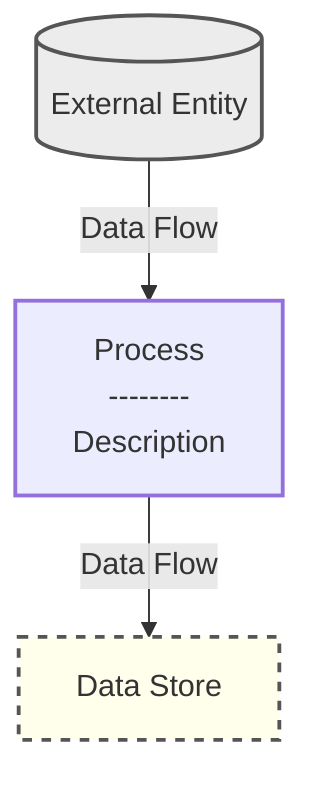
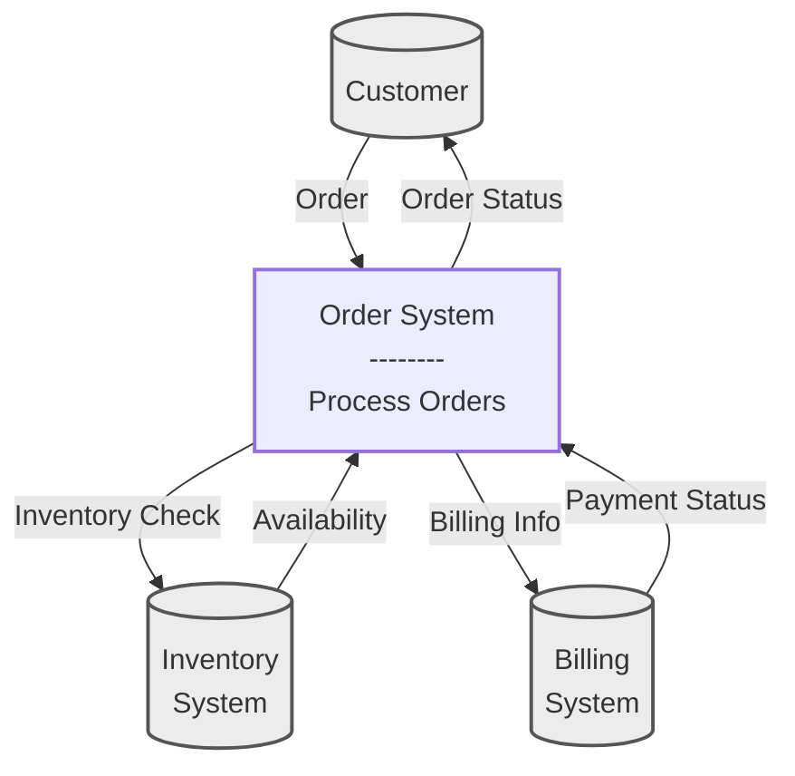

# Data Flow Diagrams for Lazy Programmers (Gane & Sarson)

Here's the ultra-concise guide to creating Gane & Sarson DFDs in Obsidian Markdown:

## Basic Elements

## Steps to Create

1. Use Obsidian with Mermaid plugin enabled
2. Create a mermaid code block with `flowchart TD` (top-down) directive
3. Define elements using standard Gane & Sarson symbols:
    - Process: Rectangle with rounded corners
    - External Entity: Rectangle or circle
    - Data Store: Open-ended rectangle
    - Data Flow: Arrow with label
4. Style with classes to match Gane & Sarson conventions
5. Maintain hierarchy with levels (DFD0, DFD1, etc.)

## Example for Context Diagram (DFD0)

That's it! Just copy these patterns and customize for your system.